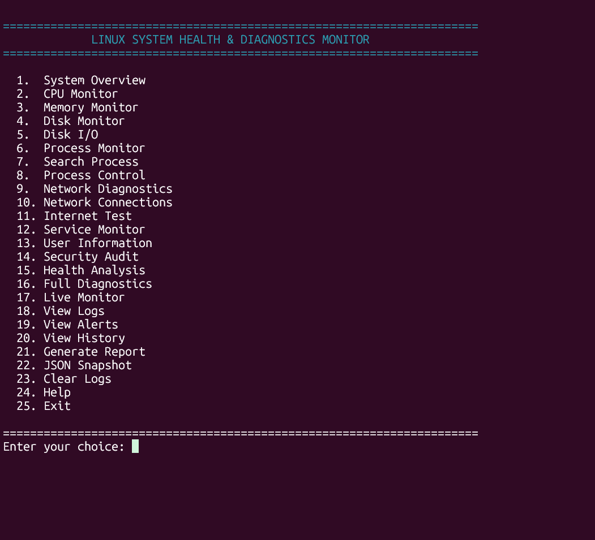
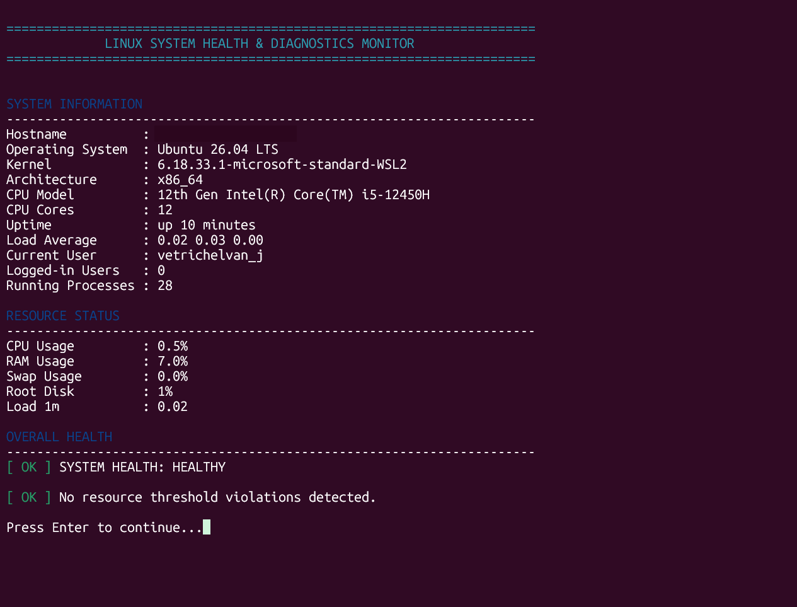
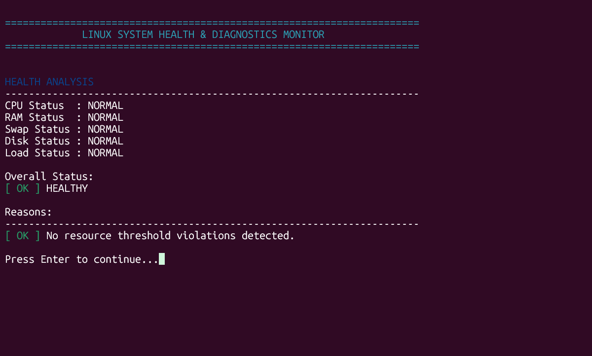
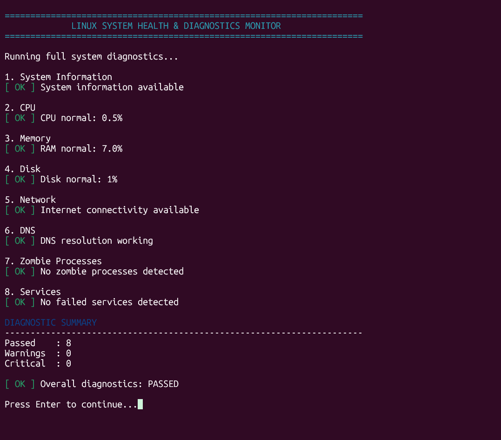
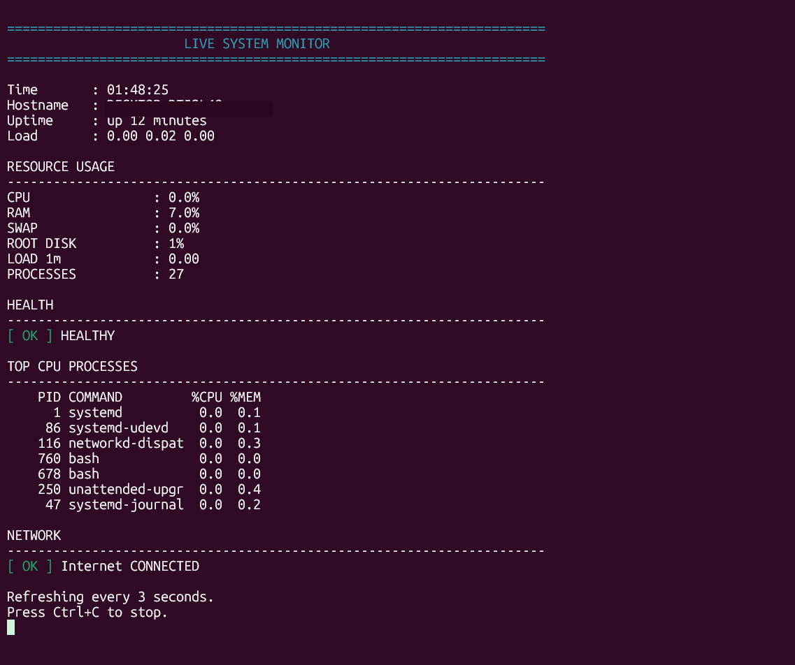

# 🐧 Linux System Health & Diagnostics Monitor

A Bash-based Linux system monitoring and diagnostics tool that provides real-time visibility into CPU, memory, disk, processes, networking, services, system health, alerts, logs, and historical resource usage.

The project is designed to demonstrate practical Linux administration, Bash scripting, process management, networking, monitoring, logging, and system-level troubleshooting.

---

## 🚀 Features

### 🖥️ System Monitoring

- System overview
- CPU usage monitoring
- Per-core CPU information
- Memory and swap monitoring
- Disk usage monitoring
- Disk I/O statistics
- Load average monitoring
- System uptime
- Hostname and operating system information
- CPU model and architecture
- Running process count

### ⚙️ Process Management

- Top CPU-consuming processes
- Top memory-consuming processes
- Process search
- Process tree
- Zombie process detection
- Process control
- Safe process termination
- Support for `SIGTERM` and `SIGKILL`

### 🌐 Network Diagnostics

- Network interface information
- IP address information
- Default gateway
- Routing information
- DNS configuration
- Active network connections
- Listening ports
- Gateway connectivity test
- DNS resolution test
- Internet connectivity test
- Network latency information

### 🔧 Service Monitoring

- Failed service detection
- System service status
- System running-state checks
- Service diagnostics

### 🛡️ Security Audit

- Basic system security checks
- User information
- Process checks
- Network listening checks
- System configuration checks

### ❤️ Health Monitoring

The monitor evaluates system health using configurable thresholds for:

- CPU usage
- RAM usage
- Swap usage
- Disk usage
- Load average

Health states:

```text
NORMAL
WARNING
CRITICAL
cat >> README.md <<'EOF'

---

## 📸 Screenshots

### Main Menu



### System Overview



### Health Analysis



### Full Diagnostics



### Live Monitoring


EOF
